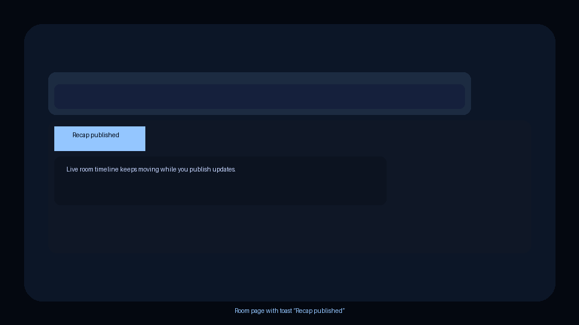
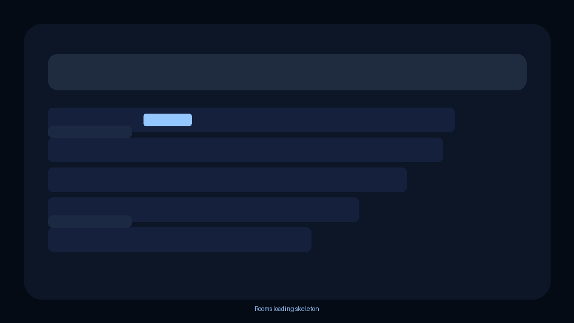
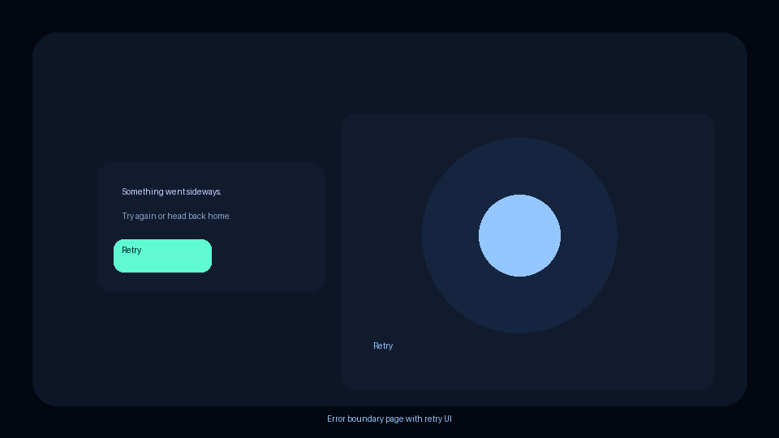

# OnRecord

**Phase 8: GitHub presentation upgrades (make the polish obvious)**  
OnRecord is a verified, person-centric press conference platform where accredited reporters join permanent rooms for a public figure, queue questions into a moderated flow, and walk away with on-record answers, transcripts, asset packages, and public recap pages.

- Accredited reporting flows stay live even when the demo is paused, so every moment is recruiter-ready.
- Persistent rooms keep context for follow-up questions, recap publishing, and offline review.
- Phase 8 highlights the polish that recruiters notice: consistent UI, failure safety nets, and a confidence-building demo experience.

## Live Demo

The live demo shows the full recruitment narrative: a room loading smoothly, a transcript flowing in real time, and a recap toast confirming the publish. Watch for the reporter queue, Recap published toast, and the public recap link inside the room.

- **Press flow:** moderators approve questions, reporters tag answers, and the recap timeline keeps everyone aligned.
- **Assets at a glance:** transcripts, recordings, and citation-ready details ship with every session.
- **Validation:** E2E smoke tests ensure the same journey runs locally before it hits GitHub.



## UI Polish Pack

Recruiter-facing UI polish means every panel loads with intent: skeleton placeholders, consistent empty states, friendly error boundaries, and global toasts keep the experience calm even when data is slow or absent.

- **Skeletons:** Next.js `loading.tsx` and shared `ui/skeleton.tsx` shapes reserve space for tables, headers, and cards so the layout never jumps (shown below).  
- **Empty states:** `EmptyState` standardizes iconography, copy, and CTAs whenever a list is empty, so the tone stays confident.
- **Error boundaries:** `ErrorState` plus `ClientErrorBoundary` means we can show a retry path without crashing the rest of the screen.  
- **Toasts:** Sonner-powered global toasts surface confirmations like "Recap published" or "Question queued" without threading callbacks through every component.



## UI Reliability

Read the full proof in [docs/ui-reliability.md](docs/ui-reliability.md) — every detectable failure mode has telemetry, a defined recovery, and a regression test.



Handled failure modes (six recruiter-visible guarantees):

- **Offline / flaky networking:** banner warns "You're offline," queue actions stay enabled, and buttons re-enable when connectivity returns.  
- **Auth expiry:** the session-expired toast stays visible with a "Go to login" CTA until the reporter re-authenticates.  
- **Real-time disconnects:** the question queue chip cycles through "Live," "Reconnecting...," and "Disconnected," and a manual "Reconnect" button is ready when retries run out.  
- **Slow queries / cold starts:** skeletons and "Still working..." copy keep the layout steady until data arrives.  
- **Permission / role issues:** `/whoami` explains identity + access, guarded routes show a clear fallback, and QA scripts prove the guard reacts correctly.  
- **Unhandled JS errors:** `ClientErrorBoundary` renders `ErrorState` with retry + home links so recruiters always get a friendly recovery screen.

## Component Mini-Library

Polish is enforced through shared primitives; see [docs/components.md](docs/components.md) for the implementation details.

- **Skeletons (`ui/skeleton.tsx`):** shape variants and utilities mirror every major panel while data resolves.  
- **Table (`ui/table.tsx`):** semantic markup, optional sticky headers, dense spacing, and hover/selected states keep grids consistent.  
- **Dialog (`ui/dialog.tsx`):** Radix-powered overlays ship focus trapping, ESC/Click-to-close, and accessible title/description pairs.  
- **Alert (`ui/alert.tsx`):** inline alerts add `role="alert"` and `aria-live` for error, warning, and success tones.  
- **EmptyState (`components/empty-state.tsx`):** icon + copy + optional action slot unify every "no data" message.  
- **ErrorState (`components/error-state.tsx`):** retry + "Go home" buttons are wired once so every boundary looks the same.  
- **LoadingButton (`components/loading-button.tsx`):** spinner, width lock, and `loadingText` keep async actions predictable.  
- **ClientErrorBoundary (`components/client-error-boundary.tsx`):** wraps risky panels (question queue, etc.) and reprises `ErrorState` with retry hooks plus telemetry.

## Quality Gates

We gate every push with linting, types, Playwright regressions, and Axe accessibility checks.

- `pnpm lint` (eslint) protects formatting and DX rules.  
- `pnpm typecheck` (tsc) runs across the workspace.  
- `pnpm --filter @onrecord/web test:e2e` drives the Playwright suite (`polish.spec.ts` and friends).  
- Axe a11y (`apps/web/playwright/a11y.spec.ts` with `@axe-core/playwright`) catches serious/critical violations as part of the Playwright run.

## Run locally

### 1) Install

```bash
pnpm install
```

### 2) Start Supabase

```bash
pnpm supabase:start
pnpm supabase:reset
```

Copy the anon key from the Supabase output into `apps/web/.env.local` (or a root `.env.local` if you prefer) using `NEXT_PUBLIC_SUPABASE_ANON_KEY` and `NEXT_PUBLIC_SUPABASE_URL` from the `.env.example` file.

### 3) Start the web app

```bash
pnpm dev
```

### 4) Run quality gates

```bash
pnpm lint
pnpm typecheck
pnpm e2e
```

## Docs

- Phase 8 rationale: `docs/architecture.md`, `docs/demo-script.md`  
- Reliability and UI polish: `docs/ui-reliability.md`, `docs/components.md`  
- APIs and commitments: `docs/api/openapi.yaml`, `docs/threat-model.md`, `docs/test-matrix.md`  
- Extra reference: `docs/adr/`, `docs/privacy.md`, `docs/reviewers.md`
